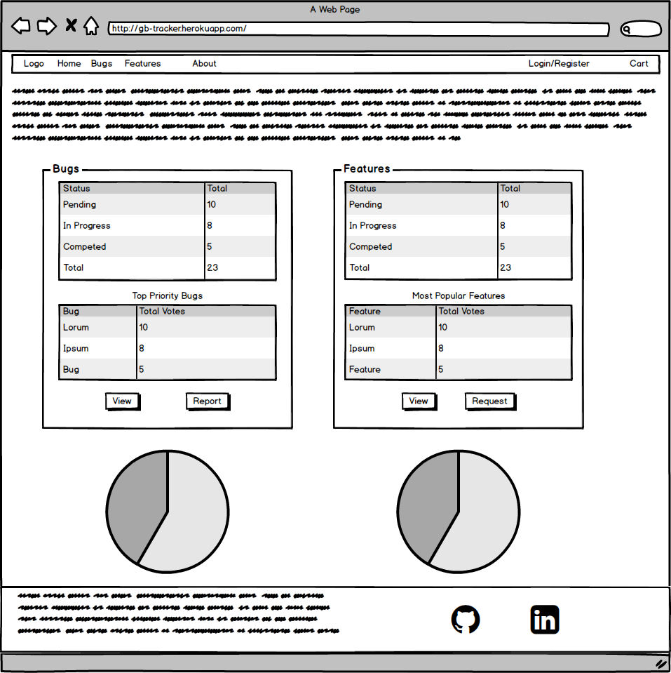
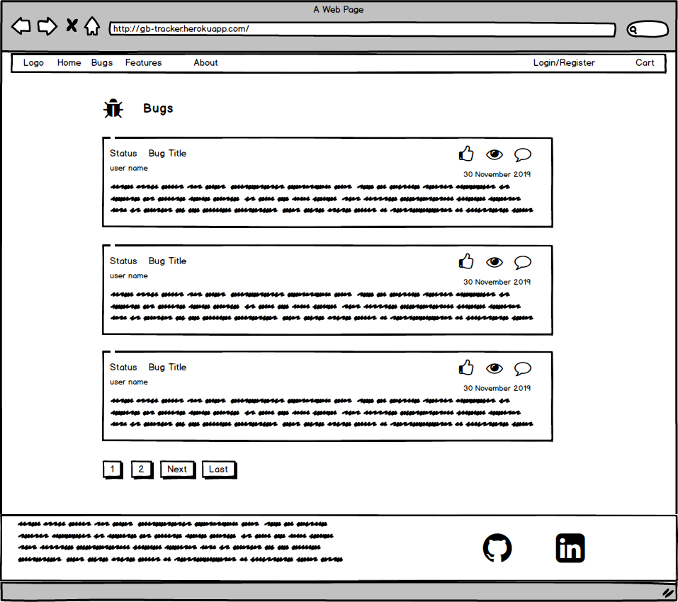
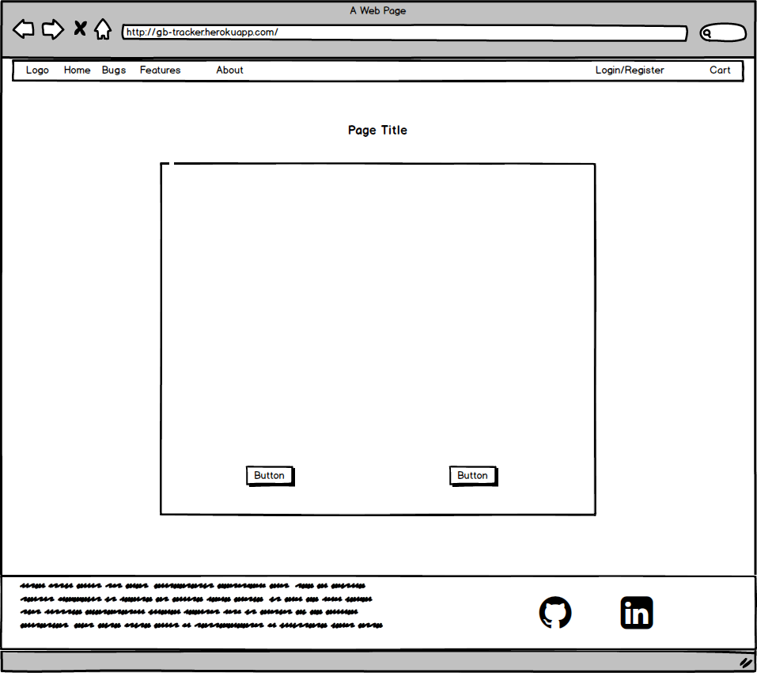

# Issue Tracker - Django app

[](https://travis-ci.org/gbronca/django-app)

The App-Tracker is the 5th and last project for the Fullstack Software Development Course by the Code Institute. It is built in [Django](https://www.djangoproject.com/), one of the most popular Python Framework.

The App-Tracker app can be viewed [here](http://gb-tracker.herokuapp.com/)

## UX

The idea behind the project is that clients from other projects would have a platform where they could report bugs on their sites and request new features.

The app incorporates ann user authentication system. Registered user can:

* Request features
* Report bugs
* Upvote a bug, pushing it's priority higher
* Pay to upvote a feature
* Comment on bugs and features from other users or their own
* Delete own bug or feature
* Access own profile page
* Update their personal information on the profile page
* Reset their password

The site also provides a table with statistics on bugs and features and a pie chart to visualise the progress on fixing bugs and implementing features.

To upvote a feature, the user must first add the feature into the cart and make a payment via [Stripe](https://www.stripe.com/).

### User Stories

1. As a visitor, I would like to browse the bugs posted.

2. As a visitor, I would like to browse the features posted.

3. As a visitor, I would like to read the comments posted on each bug.

4. As a visitor, I would like to read the comments posted on each feature.

5. A user should be able to see the status of a bug or feature;

    * The possible states are:

        * Pending;
        * In Progress;
        * Completed;

6. A user should be able to open a recipe and see ingredients, instructions and cooking time.

7. A user should be able to create an account.

8. A registered user:
    * Can report a new bug;
    * Can request a new feature;
    * Can upvote a bug;
    * Can upvote a feature (by making a financial contribution);
    * Can comment on a bug;
    * Can comment on a feature;
    * Can check their cart;
    * Can add features to their cart;
    * Can remove features from their cart;
    * Can pay for features in their cart;
    * Can edit their own profile;
    * Can edit features and blogs they created;
    * Can reset their password.

### Features

* The app was designed in Django 2.2.9 and Python 3.7.6 using MySQL Database locally. When deployed to Heroku the database was migrated to PostgreSQL.

* Django integrated OAuth to manage user accounts, sign-ins, sign-ups, sign-outs and password resets.

* Complete CRUD implementation of the ticket app. Registered users can create, edit, delete and update their own requests.

* Upvote of bugs and features. Upvote of features is dependant on completion of payment via Stripe.

* The individual apps are scalable and can easily be integrated into other projects.

* The user is able to reset the password, as long as the correct email is registered in the app. An email is sent with a link allowing the user to reset the password.

* Editing of bugs and features is restricted to the user that created it.

* The app makes use of the Stripe API so users can support the development of new features.

* The charts on the home page are created using Chart.js.

#### Features for future development

* Filters. It would be nice to be able to filter tickets by their status or order them by popularity.

* Update Stripe integration to Stripe v3.

* Add images to tickets and save the images in AWS S3.

### Wireframes







## Technologies

* HTML 5

* CSS 3

* Javascript

* [Bootstrap 4](https://getbootstrap.com/)

* [Card.js](https://github.com/jessepollak/card)

* [Chart.js](https://www.chartjs.org/)

* [Stripe](https://stripe.com/gb)

* [Python 3.7.6](https://www.python.org/)

* [Django 2.2.9](https://www.djangoproject.com/)

* [PostgreSQL](https://www.postgresql.org)

* [Heroku](https://www.heroku.com/)

* [Travis-CI](https://travis-ci.com)

Card.js is used during checkout to format and display the card information in the form.

Chart.js is the Javascript library responsible for creating the charts on the homepage.

## Tests

All pages have been tested extensively during development by myself. Once deployed, the app was tested by a small number of people, mainly family members and work colleagues that have reported any issues they may have found.

It was tested different browsers, including Firefox, Safari, Chrome and Brave for macOS and Windows 10.

The site was tested for responsiveness using Firefox and Chrome dev tools and on the iPhone.

* HTML validated by [The W3C Markup Validation Service](https://validator.w3.org/)

* CSS validated by [The W3C CSS Validation Service - Jigsaw](https://jigsaw.w3.org/css-validator/)

* Python compliant to PEP8 via [Pylint](https://pylint.org/).

### Compatibility

Tested on:

* Google Chrome

* Firefox

* Safari

* Brave

## Deployment to Heroku

The project is hosted in Heroku. Please follow the steps below to deploy the application to Heroku.

1. Create a Heroku account if you don't already have one.

2. Install [Heroku Command Line](https://devcenter.heroku.com/articles/heroku-cli#download-and-install)

3. in the command line type `heroku login`

4. Install gunicorn `pip install gunicorn`

5. Navigate to the project folder and create the `requirements.txt` file by typing `pip freeze > requirements.txt` in the command line

6. Create a new app Heroku app. If using the command line, in terminal type `heroku create appname`

7. Add the URL of your new Heroku app to the `ALLOWED_HOSTS` variable in `settings.py`

8. Create a `Procfile` file

9. Edit the Procfile and add `web: gunicorn django_tracker.wsgi`. Save the file and close it.

10. Push the code to Heroku: `git push heroku master`. Alternatively, go to Heroku Dashboard, select your app, Deploy, Deployment Method, Github.

11. Configure the following environmental variables in Heroku py typing in the command line `heroku config:set VARIABLE_NAME=VALUE` or in Settings in the Heroku Dashboard.

    ```python
    DEBUG
    SECRET_KEY
    EMAIL_HOST
    EMAIL_PORT
    EMAIL_USE_TLS
    EMAIL_USER
    EMAIL_PASSWORD
    STRIPE_PUBLISHABLE_KEY
    STRIPE_SECRET_KEY
    ```

12. Install [PostgreSQL](https://www.postgresql.org/) on your local machine.

13. Heroku provides a helper tool to migrate the database from SQLite3 to PostgreSQL. It can be installed by typing `pip install django-heroku`

14. Import django-heroku in `settings.py` file by adding on top of the file `import django_heroku`. At the very bottom of the file add `django_heroku.settings(locals())`

15. Make sure to update `requirements.txt` file.

16. in the command line type: `heroku run python manage.py migrate` to migrate the database and create the tables.

17. To create a superuser via Heroku bash commands type in the command line `heroku run bash`, then `python manage.py createsuperuser`. after entering the superuser details, type exit to exit the bash terminal.

### Local Deployment

* Clone the repository

* Create a virtual environment and install the project dependencies `pip install -r requirement.txt`.

* setup the environment variables

    ```python
    DEBUG
    SECRET_KEY
    EMAIL_HOST
    EMAIL_PORT
    EMAIL_USE_TLS
    EMAIL_USER
    EMAIL_PASSWORD
    STRIPE_PUBLISHABLE_KEY
    STRIPE_SECRET_KEY
    ```

* on terminal type:

  * `python3 manage.py makemigrations` to make migrations

  * `python3 manage.py migrate` to migrate

  * `python3 manage.py runserver` to run the app.
